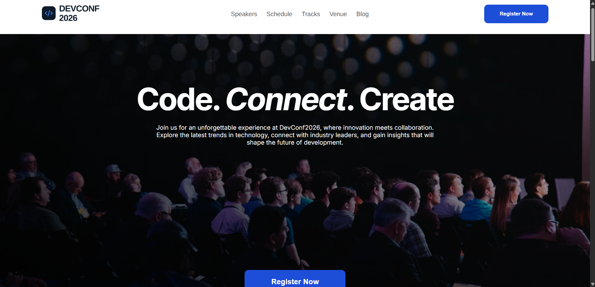

# 🚀 DevConf 2026

DevConf 2026 is a responsive web application designed for a developer conference. It presents key event details including conference schedules, speaker profiles, and session information in a structured, user-friendly interface.

---

## 📸 Demo / Preview



---

## 🌐 Live Links

* 🔗 **Live Website:** [DevConf 2026 Live Demo](https://abdullahredoan.github.io/DevConf2026/)
* 📁 **GitHub Repository:** [AbdullahRedoan/DevConf2026](https://github.com/AbdullahRedoan/DevConf2026/tree/main)

---

## 🛠️ Main Technologies Used

* **HTML5** – Page structure and semantic content layout
* **CSS3** – Custom styling, typography, and layout formatting

---

## ✨ Key Features

* 🗓️ **Event Schedule:** Clean presentation of conference sessions, timelines, and agenda items.
* 🎙️ **Speaker Profiles:** Highlighted sections showcasing guest speakers and event hosts.
* ⚡ **Lightweight & Fast:** Built using pure HTML and CSS for high performance and fast page load times.

---

## 📦 Dependencies

This project is built using native **HTML5** and **CSS3**. It requires no external package managers (`npm`/`yarn`), frameworks, or third-party JS library dependencies to run.

---

## 💻 How to Run Locally

Follow these simple steps to run the project locally on your machine:

1. **Clone the repository:**
   ```bash
   git clone [https://github.com/AbdullahRedoan/DevConf2026.git](https://github.com/AbdullahRedoan/DevConf2026.git)

2. **Enter the project folder:**
   ```bash
   cd DevConf2026
   
3. **Open the application:**
Double-click the index.html file to launch it in any web browser, or serve it using the Live Server extension in VS Code.
